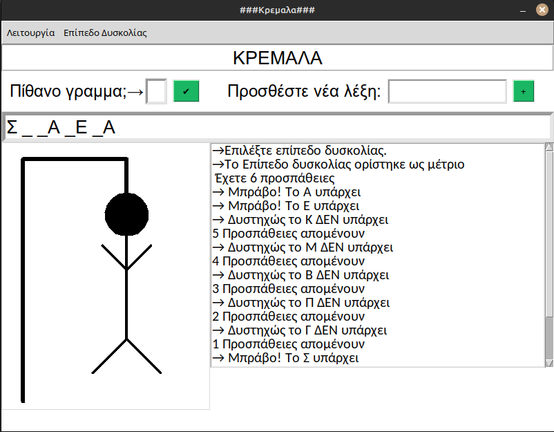
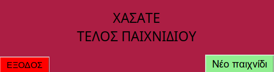

# Hangman_Game
A simple **hangman** game with greek words. The player must guess letters to uncover a hidden word, before running out of attempts (Easy : 8 wrong letter attempts, Medium : 6 wrong letter attempts, Hard : 4 wrong letter attempts)
This project built using **Python**. 
The **Graphics User Interface** build using the **tkinter** library and the **Hangman Animation** built using the **turtle** library.

---

## Features of the Game
 - Guess words letter by letter
 - Random word selection
 - Limited attempts before losing
 - Winning and losing messages
 - Add new word using the "+" icon in game

 ---

## Installation

### Step 1: 
- Clone the repository
---
### Step 2:
- Change to folder: `cd Hangman_Game`
---
### Step 3: 
- Activate the virtual environment. `source .venv/bin/activate` [MacOS and Linux].
- or `.venv\Scripts\activate.bat` [Windows Command Prompt], `.venv\Scripts\Activate.ps1` [Windows PowerShell].
---
### Step 4:
- Run the script python `python3 Kremala.py` [MacOS and Linux].

- or `python Kremala.py` [Windows].
---
##  Preview
- The graphical user interface of the game.

---
## Code Revision
- [] Restructure turtle_kremala.py
- [] Restructure win\lose messages

